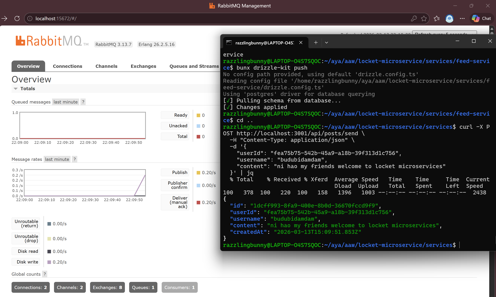
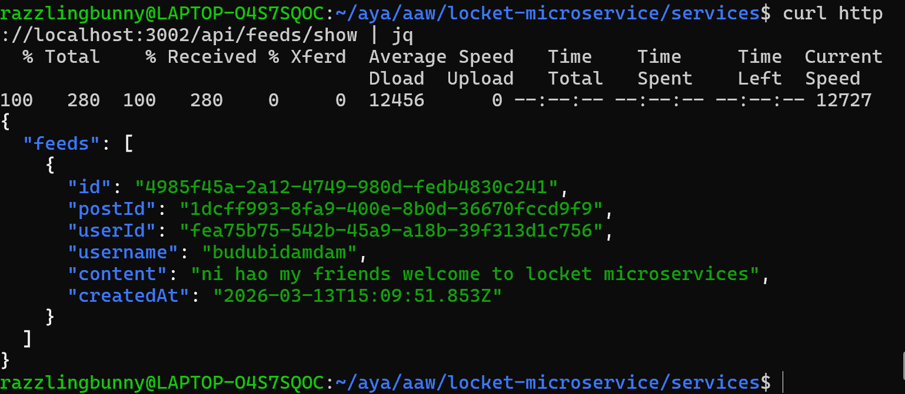

## A02

**Alyanda Astri - 2206028365**

Untuk membuat suatu event, user dapat membuat suatu post dengan memanggil API. Berikut contoh curl untuk membuat post:
```
curl -X POST http://localhost:3001/api/posts/send \
  -H "Content-Type: application/json" \
  -d '{
    "userId": "fea75b75-542b-45a9-a18b-39f313d1c756",
    "username": "budubidamdam",
    "content": "ni hao my friends welcome to locket microservices"
  }' | jq
```
<br>

Untuk melihat proses pengiriman message secara real-time, kita dapat mengakses halaman management RabbitMQ untuk track message yang dikirim kepada consumer. Pada gambar di bawah ini terlihat message rate mengalami kenaikan ketika user membuat request untuk post. Hal ini dikarenakan publish event dilakukan bersamaan ketika user membuat post.

<br>

Jika proses pengolahan data oleh consumer sudah berjalan dengan benar, di mana pada kasus ini consumer memasukkan data dari message menuju db, maka data tersebut dapat dilihat dari feed-service. Melihat data apakah sudah masuk menuju feed-service dapat dilihat dengan melakukan request di bawah ini:
```
curl http://localhost:3002/api/feeds/show | jq
```
Berikut contoh hasil dari curl tersebut:

<br>

Komunikasi asynchronous ini berjalan dengan post service sebagai publisher, seperti dapat dilihat pada `post-service/src/events.ts`, program akan mempublish event ketika fungsi `publishEvent` dipanggil. Lalu pada `feed-service/src/consumer.ts` dijelaskan bagaimana ia berperan sebagai consumer dari event `post.sent` dan bagaimana ia mengolah messagenya serta melakukan insert data menuju db. <br>
Dengan komunikasi asynchronous ini, jika `post-service` mempublish event ketika `feed-service` sedang nonaktif, maka message akan tersimpan di dalam queue, dan kemudian akan dikirim ketika `feed-service` sudah aktif kembali. Komunikasi ini bersifat non blocking, sehingga `post-service` bisa terus mempublish event tanpa terikat dengan `feed-service`, less coupling. <br>
Jika menggunakan RESTful API seperti biasa, untuk tiap request yang dibuat maka service akan terikat untuk menunggu mendapatkan respon dari tujuan. Hal ini membuat sistem bersifat sinkronus. Selain itu, tanpa adanya message broker, maka jika salah satu service mati, komunikasi tidak dapat berjalan sama sekali.<br>

### Penggunaan GenAI
Pada pengerjaan tugas ini, saya menggunakan ChatGPT untuk mencari ide terkait contoh aplikasi yang memerlukan arsitektur Event-Driven. Selain itu, ChatGPT juga digunakan untuk membantu dalam proses pengerjaan seperti membantu debugging
